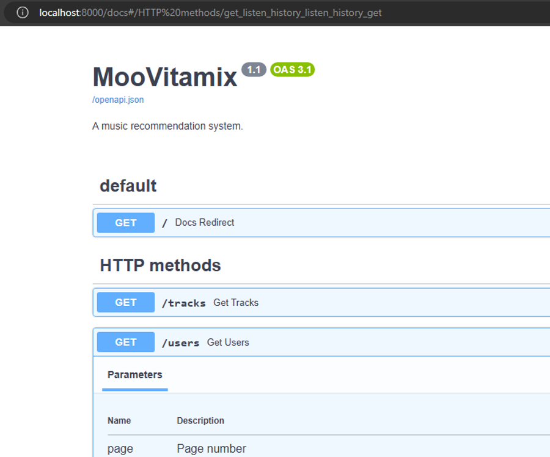
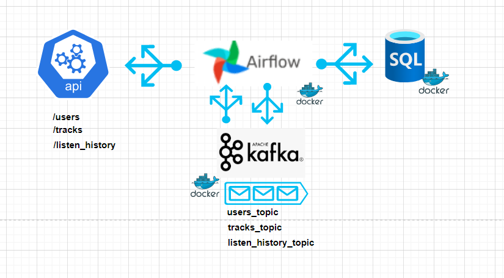
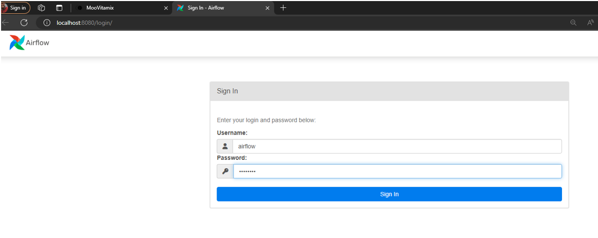
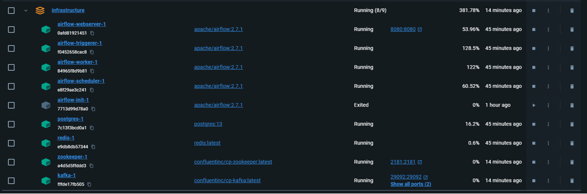
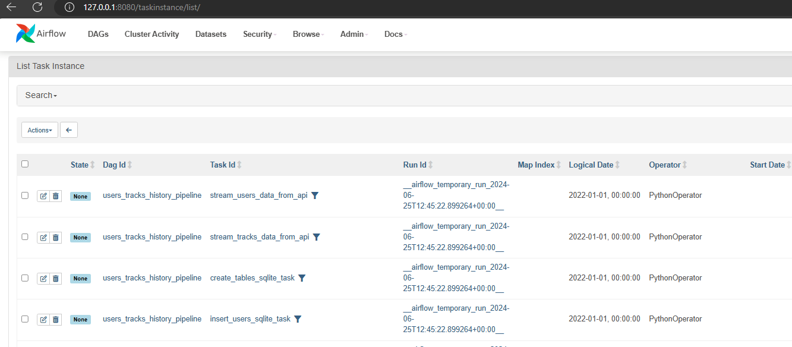
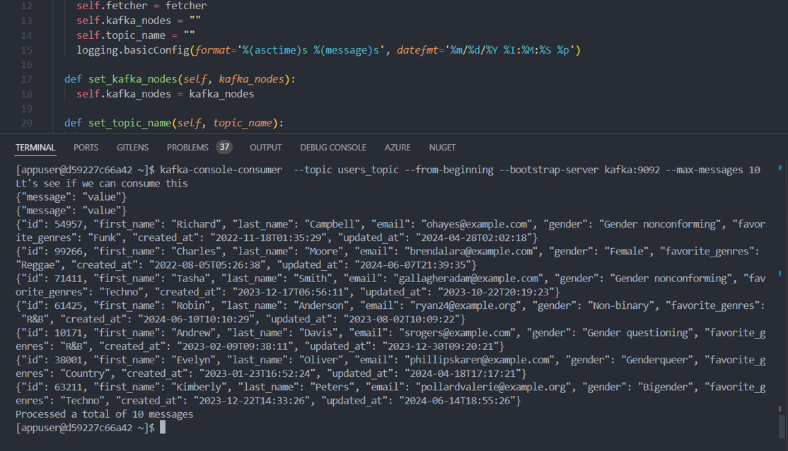
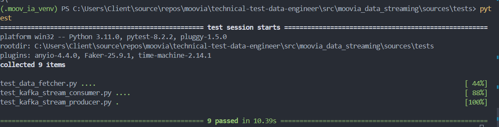
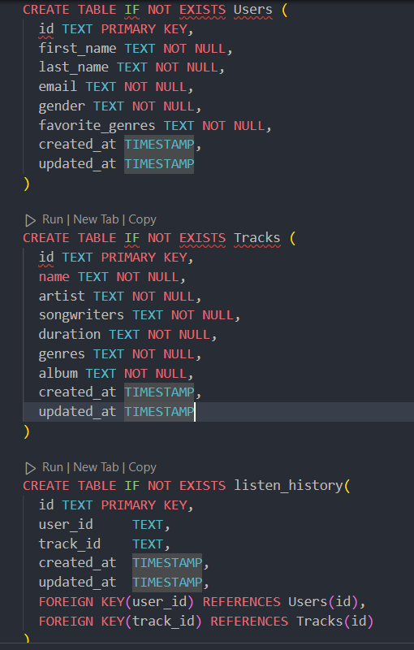
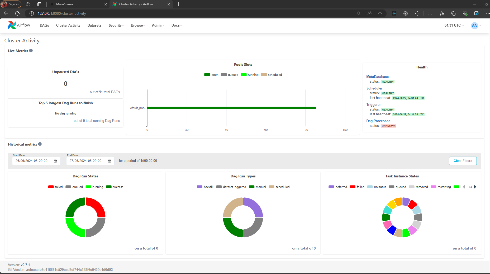

### Réponses aux questions

1. Un environnement virtuel a été crée `.\.moov_ia_venv` et activé.
   À partir de la documentation Swagger de l'API fournie nous avons pu prendre connaissance des differents endpoints, leurs méthodes et leurs signatures.

#### 1. Élaboration du flux de données

- Architecture
  Nous avons opté pour une architecture résiliante, performante et extensible basée sur l'implémentation d'un orchestrateur autour de l'outil **airflow** et la publication des messages lues de l'API dans des topics **Kafka** et ces messages sont par la suite consommés via des tâches d'un `DAG Airflow` et poussés dans la base de données.

  

Nous avons crée dans les sources du projet un dossier
`src/moovia_data_streaming/sources` dans lequel se trouve tout le code source permettant d'implémenter cette architecture.
Sous le dossier `infrastructure/dags` nous avons developpé le fichier `airflow_data_pipeline_dag.py` qui contient les tâches de notre DAG.

_À Noter que nous avons copié les principaux codes sources python developpés dans ce dossier `infrastructure/dags` dans le but de pouvoir tester l'executiion des tâches du DAG Airflow depuis le container Docker, rendu dans le container Docker le code dag ne parvenait pas à retrouver les autres packages du projet python car seuls les dossiers liés à airlflow y sont visibles depuis le container d'oà la raison de la copie des sources uniquement pour des besoins de test._

- Infrastructure

  Afin de préparer toute l'infrastructure de test, vous devez executer les docker compose ci-dessous sous le dossier infrastructure:

  1. `docker-compose -f .\docker-compose-airflow.yaml up airflow-init`
  2. `docker-compose -f .\docker-compose-airflow.yaml up`
  3. `docker-compose -f .\docker-compose-kafka-zookeper.yaml up`

Une fois les containers crées on peu alors prendre l'ID du container représentant le webserver installé avec Airflow et executer la commande `docker exec -it <<ID_CONTAINER>> /bin/bash` ce qui nous permet de rentrer dans le container et on peut executer la commande `airflow tasks test users_tracks_history_pipeline stream_users_data_from_api 2022-01-01` pour tester une des tasks du DAG.

Quelques tasks executées qui sont visibles via l'interface Web Airflow depuis le container Docker

Une fois les messages lus et "produced" dans le topics kafka nous avons pu nous connecter au container (`docker exec -it <<ID_CONTAINER>> /bin/bash`) du serveur kafka et vérifier que les messages sont la en les consommants via une commande voir capture ci-dessous.

#### 2. Tests Unitaires

Nous avons implémenté quelques test unitaires pertinants ils se trouvent dans le dossier: `src/moovia_data_streaming/sources/tests` pour les executer, se placer à la racine du dossier `src\moovia_data_streaming\sources\tests` et faire `pytest`

#### 3. Schéma de base de données

Nous avons opté pour une base de données relationnelles car les informations sont bien structurés au niveau de l'API et aussi cela facilitera la tâche des data scientist avec les requêtes SQL. Le schéma choisi se présente comme dans la capture ci-dessous

La table listen_history est une table d'association entre les Users et les Tracks avec en plus sa clé primaire à elle et une date de création de la playlist, le schéma est assez simple.

#### 4. Système de surveillance

Avec l'utilisation d'un outil d'orchestration comme **Airflow** nous avons accès à la santé de notre pipeline de données executant du code python etc.

Sous l'onglet _Cluster activity_ par exemple de la console Airflow nous pouvons avoir un dasboard qui nous permet de monitorer notre pipeline.

voir le lien ci-dessous page pour plus de détails sur le logging et le monitoring avec Airflow.

[Airflow Logging & Monitoring](https://airflow.apache.org/docs/apache-airflow/stable/administration-and-deployment/logging-monitoring/index.html)

#### 5. Calcul de recommantation et entrainement de modele

Les donnnées seront ingérées par notre pipeline de données sur une base jounalières et stockées dans nos bases de données, ensuite ces données seront extraites de façons continue via des tâches python et utilisées pour réentrainer le modèle de machine learning utilisé pour notre système de recommandation qui le rendra plus efficace, les méthodes et pratiques du MLOps permettront de déployer ce modèle de façons continue et automatisée.

> Emmanuel Nguemeta Fomekong
