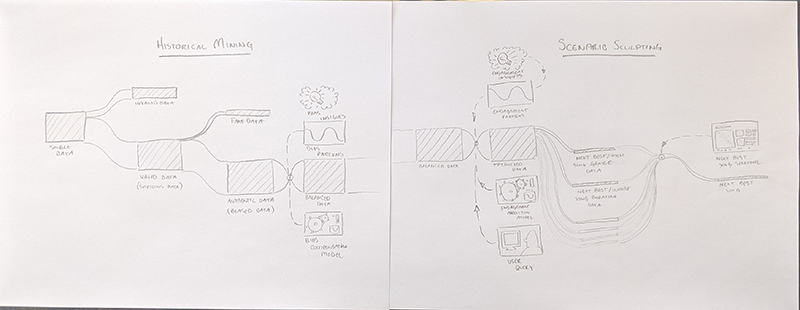

# Réponses du test

## _Utilisation de la solution (étape 1 à 3)_

# Bienvenue dans MooVitamixFlux 🚀

Nous sommes ravis de vous livrer **MooVitamixFlux**—votre solution personnalisée de synchronisation des données pour le système de recommandation musicale MooVitamix. Ce dépôt contient tout ce dont vous avez besoin pour commencer et maintenir votre projet facilement.

---

## 🌟 Fonctionnalités principales  

- **Extraction des données source :** Le pipeline extrait les données des endpoints MooVitamix de manière incrémentale, traitant les informations par morceaux pour une gestion efficace.  
- **Traitement hiérarchique :** Les utilisateurs et les titres musicaux sont traités en premier, permettant une validation initiale avant de passer aux sessions et aux pistes associées.  
- **Chargement atomique :** Les données sont chargées dans un format atomique structuré (utilisateurs, titres, sessions, pistes de session), prêtes pour l'extraction de caractéristiques et une ingestion directe par des modèles d'apprentissage automatique.  
- **Suivi des états d'extraction :** Le pipeline conserve un historique détaillé des états d'extraction, permettant de diviser les opérations en mises à jour de taille raisonnable et offrant une vue historique sur la progression globale.  
- **Journalisation accessible :** Tous les événements notables du pipeline sont enregistrés et mis à disposition du client via une interface conviviale, facilitant la traçabilité et la gestion.  

---

## 📚 Prise en main  

1. **Clonez le dépôt**  
   ~~~bash  
   git clone https://github.com/moovai/technical-test-data-engineer.git
   ~~~  

2. **Installez les dépendances**  
   ~~~bash  
   pip install -r requirements.txt  
   ~~~  

3. **Lancez l'application**  
   ~~~bash  
   uvicorn main:app --reload  
   ~~~  

---

## 💡 Comment utiliser  

Une fois l'application lancée, vous pouvez interagir avec les points de terminaison suivants :  

1. **Mise à jour des données**  
   Déclenche une opération de mise à jour, partielle ou complète, qui extrait les données des endpoints source de MooVitamix, traite les informations, et charge les données normalisées dans la base de données :  
   `GET /update`  

2. **Récupération des états d'extraction**  
   Retourne les enregistrements FIFO des états de progression des extractions précédentes, avec prise en charge de la pagination :  
   `GET /get_states`  

3. **Récupération des logs**  
   Retourne les enregistrements FIFO des événements notables du pipeline, avec la possibilité de filtrer par plage temporelle :  
   `GET /get_logs?start_datetime=<start>&end_datetime=<end>`  

   Exemple :  
   `GET /get_logs?start_datetime=2025-01-01 00:00:00&end_datetime=2025-01-08 00:00:00`  

---

## 🤝 Commentaires et support  

Nous sommes là pour vous aider ! Si vous avez des questions, des suggestions ou des problèmes :

- Ouvrez une issue dans ce dépôt.
- Contactez-nous via support@moovitamixflux.fake.com

---

Merci de nous avoir confié ce projet. Nous espérons qu'il vous servira bien et qu'il évoluera avec vos besoins ! 😊

## Questions (étapes 4 à 7)

### Étape 4

## 📊 Schéma des données normalisées

Les données utilisées dans **MooVitamixFlux** sont organisées en plusieurs tables normalisées. Chaque table représente une entité distincte du système et contient des informations structurées pour faciliter les manipulations et les analyses. Voici un aperçu des différentes tables et de leur contenu.

---

### **1. Table des Utilisateurs (`NmlUsers`)**

Cette table contient les informations normalisées sur les utilisateurs du système.

| **Champ**                |**Indexé**| **Description**                                          |
|--------------------------|--|----------------------------------------------------------|
| `user_id`                |Oui| Identifiant unique de l'utilisateur.                     |
| `user_updated_at`        |Oui| Date et heure de la dernière mise à jour de l'utilisateur.|
| `user_gender`            |Non| Genre de l'utilisateur.                                 |
| `user_favorite_genre`    |Non| Genre musical préféré de l'utilisateur.                  |

---

### **2. Table des Titres (`NmlTracks`)**

Cette table contient les informations normalisées sur les titres musicaux.

| **Champ**                |**Indexé**| **Description**                                          |
|--------------------------|--|----------------------------------------------------------|
| `track_id`               |Oui| Identifiant unique du titre.                             |
| `track_duration`         |Non| Durée du titre en secondes.                              |
| `track_genre`            |Non| Genre musical du titre.                                  |
| `track_artist`           |Non| Artiste du titre.                                        |

---

### **3. Table des Titres par Session (`NmlSessionTracks`)**

Cette table fait le lien entre les sessions utilisateur et les titres joués au cours de ces sessions.

| **Champ**                |**Indexé**| **Description**                                          |
|--------------------------|--|----------------------------------------------------------|
| `session_created_at`     |Oui| Date et heure de la création de la session.              |
| `session_user_id`        |Oui| Identifiant de l'utilisateur ayant lancé la session.     |
| `session_tracks_idx`     |Oui| Indice du titre joué dans la session.                    |
| `track_id`               |Non| Identifiant du titre joué dans la session.               |

---

### **4. Table des Sessions (`NmlSessions`)**

Cette table contient des informations sur les sessions des utilisateurs.

| **Champ**                |**Indexé**| **Description**                                          |
|--------------------------|--|----------------------------------------------------------|
| `session_created_at`     |Oui| Date et heure de la création de la session.              |
| `session_user_id`        |Oui| Identifiant de l'utilisateur associé à la session.       |
| `session_tracks_len`     |Non| Nombre de titres joués pendant la session.               |

---

Ces tables sont utilisées pour gérer les différentes entités du système et sont essentielles pour assurer le bon fonctionnement des processus de synchronisation et d'analyse dans **MooVitamixFlux**.

## 🗄️ Choisir la Base de Données Idéale

Pour le système **MooVitamixFlux**, il est important de choisir une base de données qui non seulement soutient l'intégrité des données normalisées, mais aussi qui peut gérer efficacement des transactions à grande échelle tout en permettant des recherches rapides et des mises à jour fréquentes. 

Étant donné la nature du projet, qui implique des données liées aux utilisateurs, aux titres musicaux et aux sessions, une base de données relationnelle est recommandée. Nous vous suggérons :

**PostgreSQL** : C'est une base de données relationnelle très robuste et performante, particulièrement bien adaptée aux applications avec des exigences complexes de relations entre les entités. Elle prend en charge les index sur plusieurs colonnes, ce qui améliore la vitesse des recherches. PostgreSQL permet également des transactions ACID et une haute disponibilité grâce à sa réplication.

### Étape 5

# 🔍 Surveillance de la Santé du Pipeline de Données

Dans **MooVitamixFlux**, nous mettons en place une surveillance simple mais efficace pour suivre la santé du pipeline de données, en particulier en ce qui concerne le traitement des données et la gestion des erreurs.

## 📊 Suivi de l'État du Pipeline

### 1. **États de Traitement des Données**
Les états montrent en temps réel combien de données ont été traitées par le pipeline. Ces informations incluent des métriques sur le nombre de sessions, d’utilisateurs et de titres traités, permettant de suivre l'avancement des opérations.

### 2. **Logs Client**
Les logs capturent toute erreur ou événement important, indiquant les moments où quelque chose ne fonctionne pas comme prévu. Cela permet une détection rapide des problèmes et une réponse rapide.

### 3. **Endpoint de Santé**
Un endpoint éventuel de santé (par exemple, `/health`) fourni une interface simple pour vérifier l'état global du système. Il permet au client de voir facilement si tout fonctionne correctement.

### 4. **Alertes et Notifications par E-mail**
Lorsque des erreurs ou des problèmes critiques sont détectés dans le pipeline, des notifications par e-mail peuvent être automatiquement envoyées à l'utilisateur. Cela est particulièrement utile lorsque les appels de mise à jour sont automatisés, garantissant que l'équipe est informée de tout problème sans délai.

---

Cette approche permet une surveillance proactive du pipeline de données et assure une réponse rapide en cas de besoin.

### Étape 6

# 📈 Automatisation du Calcul des Recommandations

Dans **MooVitamixFlux**, l'automatisation du calcul des recommandations repose en autre sur l'attribution d'un score d'engagement à chaque titre joué dans une session utilisateur. Ce score est influencé par la position du titre dans la session.

## 🧑‍💻 Calcul du Score d'Engagement

### 1. **Logique du Score d'Engagement**
Les titres joués au début d'une session ont un score plus élevé car l'utilisateur a écouté plus de morceaux, ce qui signifie un engagement plus fort. Les titres joués plus tard dans la session reçoivent un score négatif, car l'utilisateur a arrêté l'écoute après ces titres. Le nombre de titres dans la session influence directement ce calcul, avec des sessions longues attribuant de meilleurs scores aux premiers titres.

### 2. **Sessions de Formation**

Les sessions d'écoute sont découpées en segments de longueur *n*, où *n* correspond au nombre de pistes dans une session. Lorsqu'un utilisateur effectue une requête pour obtenir une recommandation, la longueur actuelle de sa session est utilisée pour déterminer la valeur de *n*, en ajoutant 1. Par exemple, si la session en cours contient 2 pistes, alors *n = 3*, et le modèle correspondant à *n = 3* est utilisé.

#### Données d'entraînement
Pour entraîner ces modèles, les données d'entraînement sont générées à partir de :  
- **Toutes les sessions passées de longueur *n*** : en utilisant toutes les pistes de la session pour une entrée de l'entraînement.  
- **Toutes les sessions passées de longueur supérieure à *n*** : en créant plusieurs segments de longueur *n* à partir de ces sessions (par exemple, les plages 1 à 3 et 2 à 4 dans une session de longueur 4).  

#### Configurations d'entraînement possibles
Les configurations utilisées dans les modèles incluent notamment :  
- `(track_1_feature, track_2_feature) ? (track_3_feature)`  
- `(track_1_full_feature_set, track_2_full_feature_set, track_3_partial_feature_set) ? (track_3_specific_feature)`  

Cette méthode garantit que le modèle s'adapte dynamiquement à l'état actuel de la session et fournit des recommandations précises basées sur la progression de l'utilisateur.

## 🌍 Analyse des Scores Globaux

### 1. **Scores Globaux**
Les scores globaux permettent d'analyser les tendances à travers des paramètres comme le genre populaire en fonction de l'heure de la journée, du sexe de l'utilisateur, ou de la période de l'année. Ces scores sont calculés à partir des sessions complètes et permettent de dégager des informations précieuses sur les préférences des utilisateurs.

### 2. **Analyse des Fluctuations**
Il est possible que des fluctuations se produisent au sein d'une même session, car l'engagement de l'utilisateur peut varier au fil du temps. Une "énergie infinie" n'est pas réaliste, et il est important de prévoir une sortie graduelle de l'utilisateur. Cela peut se traduire par une pause ou une fin de session bien placée, ce qui non seulement optimise l'expérience utilisateur, mais augmente aussi les chances de son retour pour de futures sessions.

---

Cette approche permet d'automatiser le calcul des recommandations en fonction de l'engagement utilisateur, tout en prenant en compte les tendances globales et les fluctuations au sein d'une session pour améliorer l'expérience et fidéliser l'utilisateur.

### Étape 7

