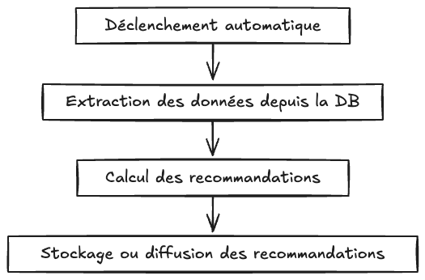
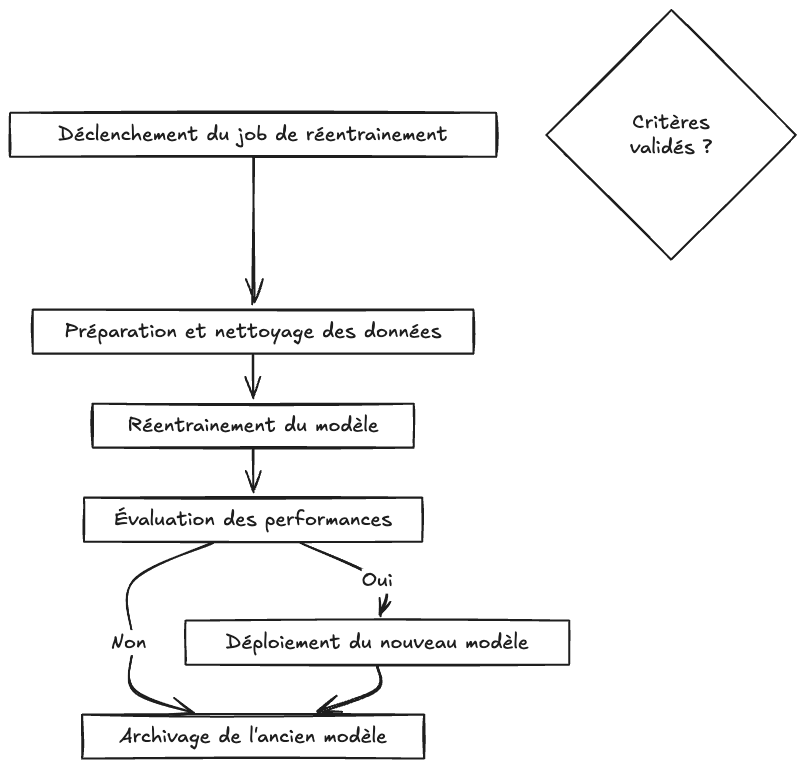

# Réponses du test

## _Utilisation de la solution (étape 1 à 3)_

### 1. Environnement virtuel et dépendances

- **Configuration de l'environnement :**
  - La solution utilise **Docker** pour créer un environnement virtuel isolé.
  - Le fichier `requirements.txt` liste toutes les librairies nécessaires (FastAPI, Uvicorn, Faker, fastapi-pagination, pytest, etc.).
- **Mise en place et activation :**
  - Un **Dockerfile** a été créé pour définir une image basée sur Python 3.9, installer les dépendances et copier l'intégralité du code source.
- **Lancement de l'application :**

  - **Construction de l'image :**  
    À la racine du projet, exécutez :

    ```bash
    docker build -t moovitamix .
    ```

  - **Démarrage de l'API :**  
    Pour lancer le conteneur et exposer l'API sur le port 8000, exécutez :

    ```bash
    docker run -p 8000:8000 moovitamix
    ```

    L'API FastAPI sera ainsi accessible sur [http://localhost:8000](http://localhost:8000) et sa documentation Swagger sur [http://localhost:8000/docs](http://localhost:8000/docs).

### 2. Flux de données (Étape 2)

- **Objectif :**  
  Élaborer un pipeline en Python pour récupérer quotidiennement les données de l'API.
- **Fonctionnement :**
  - Le pipeline, implémenté dans le fichier `pipeline.py`, effectue les opérations suivantes :
    - **Appels aux endpoints :**  
      Il interroge les endpoints `/tracks`, `/users` et `/listen_history` exposés par l'API (lancée via la commande `python -m uvicorn main:app` dans le dossier `src/moovitamix_fastapi`).
    - **Traitement et stockage :**  
      Les données récupérées sont insérées dans une base de données locale (ici, SQLite, pour le prototypage) en créant les tables `tracks`, `users` et `listen_history`.
- **Exécution du pipeline :**

  - **Important :**  
    Assurez-vous que l'API est en cours d'exécution avant de lancer le pipeline.
  - Pour exécuter le pipeline dans un nouveau conteneur (en utilisant la même image Docker), exécutez :

    ```bash
    docker run --rm --network host moovitamix python src/moovitamix_fastapi/pipeline.py
    ```

### 3. Tests unitaires (Étape 3)

- **Objectif :**  
  Valider les composants essentiels du flux de données, notamment :
  - La génération des données via les classes `TracksOut`, `UsersOut` et `ListenHistoryOut`.
  - L'initialisation de la base de données et l'insertion correcte des données.
- **Exécution :**

  - Pour lancer les tests unitaires, utilisez :

    ```bash
    docker run --rm moovitamix pytest
    ```

- **Remarque :**  
  Seuls les tests unitaires essentiels ont été mis en place pour garantir la fiabilité des principaux composants du pipeline.

---

## Questions (étapes 4 à 7)

### Étape 4 – Schéma de la base de données et choix du SGBD

- **Schéma proposé :**
  - **Table `tracks` :**
    - `id` (INTEGER, PRIMARY KEY)
    - `name` (TEXT)
    - `artist` (TEXT)
    - `songwriters` (TEXT)
    - `duration` (TEXT)
    - `genres` (TEXT)
    - `album` (TEXT)
    - `created_at` (DATETIME)
    - `updated_at` (DATETIME)
  - **Table `users` :**
    - `id` (INTEGER, PRIMARY KEY)
    - `first_name` (TEXT)
    - `last_name` (TEXT)
    - `email` (TEXT)
    - `gender` (TEXT)
    - `favorite_genres` (TEXT)
    - `created_at` (DATETIME)
    - `updated_at` (DATETIME)
  - **Table `listen_history` :**
    - `id` (INTEGER, PRIMARY KEY AUTOINCREMENT)
    - `user_id` (INTEGER, FOREIGN KEY référant à `users.id`)
    - `items` (TEXT) — stocké sous forme JSON ou CSV
    - `created_at` (DATETIME)
    - `updated_at` (DATETIME)
- **Choix du SGBD :**
  - Pour le prototypage et les tests, **SQLite** est utilisé en raison de sa simplicité et de sa rapidité de mise en place.
  - Pour un environnement de production, **PostgreSQL** est recommandé en raison de sa robustesse, de sa gestion avancée des transactions, de ses capacités d'indexation et de réplication, et de sa scalabilité.

### Étape 5 – Suivi de la santé du pipeline

- **Méthode de surveillance :**
  - **Logging détaillé :**  
    Chaque étape du pipeline (appels API, opérations sur la base de données, etc.) est loguée avec des niveaux (INFO, ERROR) pour faciliter le diagnostic en cas de problème.
  - **Métriques clés :**
    - **Taux de réussite des appels API :** Pour détecter les erreurs de connexion ou les échecs dans la récupération des données.
    - **Volume de données ingérées :** Nombre d'enregistrements traités par endpoint.
    - **Durée d'exécution du pipeline et de chaque sous-étape :** Pour identifier les goulets d'étranglement ou retards éventuels.
    - **Nombre d'erreurs/exceptions :** Pour déclencher des alertes en cas de dysfonctionnement.
  - **Outils complémentaires :**
    - En production, l'intégration d'un système de monitoring tel que **Prometheus** (pour exposer un endpoint `/metrics`) couplé à **Grafana** pour la visualisation et la configuration d'alertes est fortement recommandée.

### Étape 6 – Automatisation du calcul des recommandations

- **Approche proposée :**

  - **Orchestration des tâches :**  
    Utiliser un outil d'orchestration (par exemple, **Apache Airflow**, **Prefect** ou une planification cron) pour déclencher automatiquement le calcul des recommandations après l'ingestion quotidienne des données.
  - **Pipeline de recommandation :**
    1. **Extraction :**  
       Récupérer les historiques d'écoute, les informations utilisateur et les métadonnées des pistes depuis la base de données.
    2. **Calcul :**  
       Appliquer un modèle de recommandation (filtrage collaboratif, content-based, etc.) pour générer des recommandations personnalisées.
    3. **Stockage/Publication :**  
       Enregistrer les recommandations dans une table dédiée ou les exposer via une API pour consommation par le système applicatif.
  - **Diagramme simplifié :**

    <!-- Add Image from folder -->

    

### Étape 7 – Automatisation du réentrainement du modèle de recommandation

- **Approche proposée :**

  - **Déclenchement automatique :**  
    Mettre en place un job de réentrainement via un orchestrateur (Airflow, Jenkins, etc.) ou dans le cadre d'un pipeline CI/CD, déclenché périodiquement (hebdomadaire, mensuel) ou en fonction d'un seuil de nouvelles données.
  - **Pipeline de réentrainement :**
    1. **Préparation des données :**  
       Extraire et nettoyer les nouvelles données d'historique d'écoute et d'interaction utilisateur.
    2. **Réentrainement :**  
       Réentrainer le modèle de recommandation sur l'ensemble des données mises à jour.
    3. **Évaluation :**  
       Tester les performances du nouveau modèle sur un jeu de données de validation (mesure de la précision, du rappel, etc.).
    4. **Déploiement :**  
       Si le modèle satisfait aux critères de performance, déployer automatiquement la nouvelle version, tout en archivant l'ancienne version pour permettre un rollback si nécessaire.
  - **Diagramme simplifié :**

    

---
