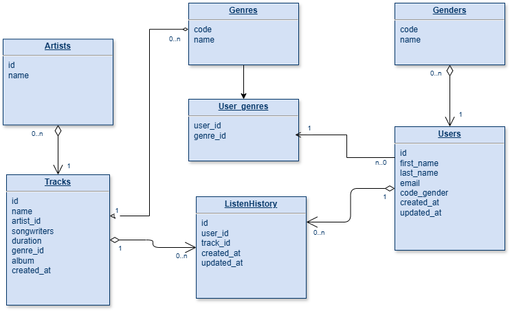

# Réponses du test

## _Utilisation de la solution (étape 1 à 3)_

### 1. Créer l’environnement virtuel

```

python -m venv venv
venv\Scripts\activate.bat

```
Ensuite installer les dépendences
```

python install -r requirements.tx

```

### 2. Mise en place du flux de données

Ce script Python met en place un pipeline de données. Cette version a pour but de collecter les données provenant de 3 APIs et de les stocker dans une base de données SQLite.

Explications sur son fonctionnement:

- Initialisation de la base de données (init_db) : Cette fonction créée la base de données et les tables si elles n'existent pas encore
- tracks : Enregistrer les morceaux de musique.
- users : Enregistrer les informations des utilisateurs.
- listen_history : Enregistrer l'historique d'écoute des utilisateurs pour l'historique d'écoute, liant les utilisateurs aux morceaux qu'ils ont écoutés.
- Récupération des données (get_data) : Cette fonction récupére des données paginées depuis les points de terminaison (endpoints) /tracks, /users, et /listen_history en bouclant sur toutes les pages disponibles.

L'Orchestration et planification (main, @repeat) : Le décorateur @repeat(every(24).hours) indique que la fonction main sera exécutée toutes les 24 heures.

### 3. Tests unitaires
Les tests couvrent les points suivants :

1.  **Initialisation de la base de données (`test_init_db_creates_tables`)** :

2.  **Récupération des données (`test_get_data_scenarios`)** :

3.  **Insertion des données (`test_insert_*`)** :


## Questions (étapes 4 à 7)

### Étape 4



#### Quel système de base de données recommanderiez-vous ?


Dans un contexte de mise en place d'une solution de recommandation pour des utilisateurs qui nécessite de l'analyse et de la Data Science, je partirais sur un systeme de base de données relationnel. 
Un datawarehouse dans lequel l'équipe pourra faire des requêtes analytiques sans impacter les performances. Comme datawarehouse je privilegierais Snowflake ou Azure Synapse si dans un environnement Microsoft.


### Étape 5
Pour surveiller efficacement la santé du pipeline je propose 3 points:
- Journalisation des actions et des erreurs. Il faudra enrichir le script en utilisant par exemple le module logging de Python. Ce qui permetra de capturer des informations importantes ( timestamp, niveau de sévérité, message). Ces logs seront centralisés dans une table dédiées ou une application (Datadog)
- Alertes automatiques. Des alertes automatiques (email, slack) seront levées en cas d'erreur ou situation critique
- Mise en place d'un Dashboard pour vérifier l'évolution des métriques clés

Les métriques clés :
- Statut d'exécution du pipeline (succes, erreur)
- Durée d'exécution du pipeline
- Nombre de ligne extraites par sources
- Nombre de nouvelles lignes chargées par table
- Nombre de valeurs nulles 


### Étape 6

**Automatisation du calcul des recommandations**

Pour cette automatisation, j'utiliserai un pipeline planifié. Je suivrai les étapes suivantes :
- Extraction : Récupération des données nécessaires (profils utilisateurs, historique d’écoute, catalogue de morceaux) depuis la base de données existante.

- Prétraitement : Nettoyage et transformation des données au besoin (gestion des valeurs manquantes, agrégation…).

- Calcul des recommandations : Application du modèle de recommandation existant (collaboratif, filtrage par contenu, etc.) pour chaque utilisateur.

- Stockage/Rendu : Sauvegarde des recommandations dans une table dédiée (par exemple, user_recommendations) et exposition via une API.

- Monitoring : Journalisation de l’exécution et gestion des erreurs/alertes en cas de problème.


### Étape 7

Le réentraînement du modèle doit lui aussi être automatisé pour intégrer les nouvelles données (par exemple, chaque semaine, chaque mois, ou selon un seuil de nouvelles interactions).

Étapes du pipeline de réentraînement :

- Extraction des données fraîches : Récupération des nouvelles données d’écoute et de profils utilisateurs.

- Préparation du dataset : Feature engineering, création des jeux d’entraînement/validation.

- Réentraînement : Exécution du script de machine learning pour entraîner le nouveau modèle.

- Évaluation du modèle : Calcul des métriques (accuracy, F1, RMSE, etc.) pour valider la qualité.

- Déploiement : Remplacement du modèle en production si les résultats sont satisfaisants (sinon, conservation de l’ancien modèle).

- Archivage & traçabilité : Sauvegarde des modèles et métriques pour audit ou rollback.

- Monitoring : Suivi des logs d’entraînement, alertes en cas d’échec ou de dégradation.