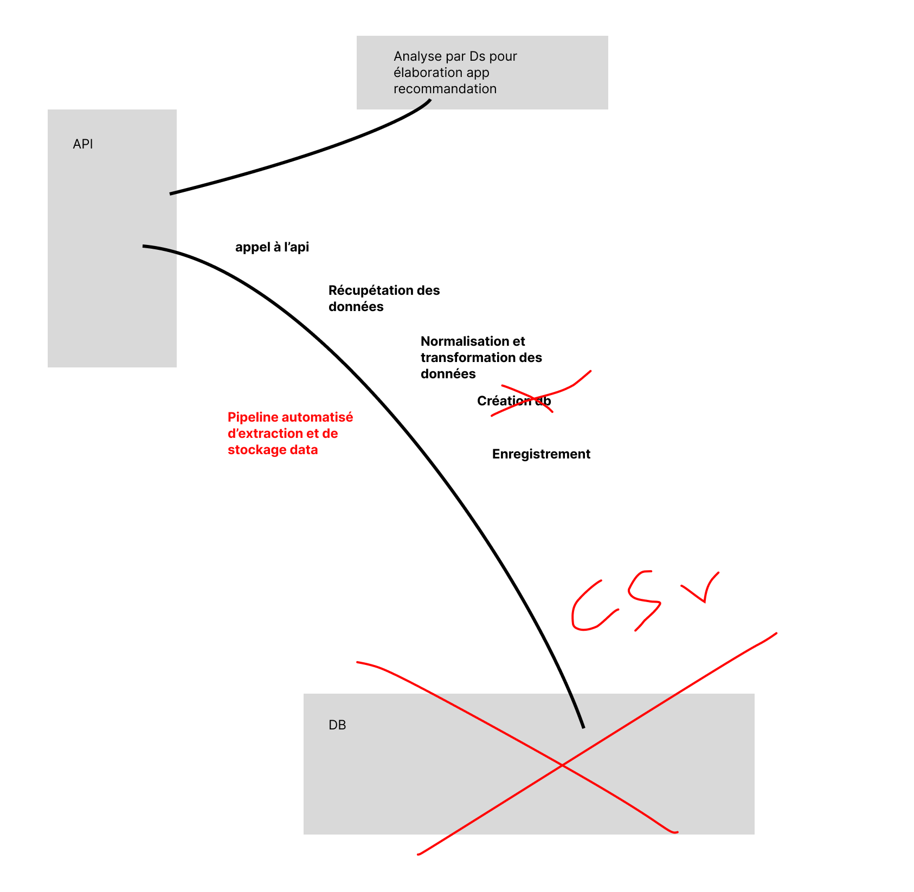

# Technical Test Data Engineer

[](LICENSE)

Here is my automated data ingestion pipeline from the application API.  

## Description  

To achieve automated data ingestion from the API, I created a simple project with a call to all the API pages and then a normalization of the data so that it can then be stored in a database. To simplify processing, the data is simply saved locally in the data/ file of the pipeline.  



## Table of Contents

- [Getting Started](#Getting-Started)
- [Launch API](#Launch-API)
- [Launch Pipeline](#Launch-Pipeline)
- [Contributing](#Contributing)
- [License](#License)  

## Getting Started    

```bash
git clone https://github.com/moovai/technical-test-data-engineer.git
cd technical-test-data-engineer
conda create --name test-api python==3.10.9
conda create --name test-pipeline python==3.10.9
```  

## Launch API    

```bash
conda activate test-api
pip install -r requirements.txt
cd src/moovitamix_fastapi
python -m uvicorn main:app
```  

## Launch Pipeline    

```bash
conda activate test-pipeline
pip install -r package_pipeline/requirements.txt
cd src
python -m pipeline.main
``` 

## Launch Test    

```bash
conda activate test-pipeline
pip install -r package_pipeline/requirements.txt
PYTHONPATH=. pytest -q
``` 

## Contributing

Pull requests are welcome. For major changes, please open an issue first
to discuss what you would like to change.

Please make sure to update tests as appropriate.

## License  

This project is licensed under the MIT License - see the [LICENSE](./LICENSE) file for details.